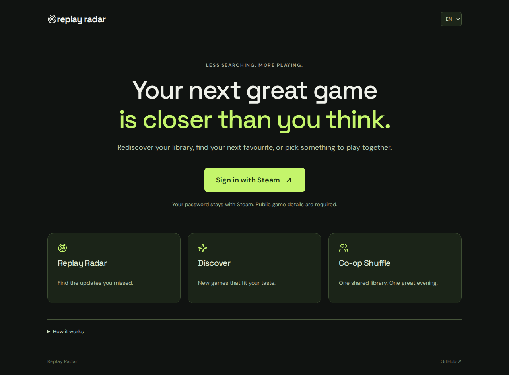

# Replay Radar

**Find your next reason to play.** Rediscover games you own, discover new ones that fit your taste, and pick a co-op game with a friend.

**[Open Replay Radar](https://replay-radar.com)** · [Hosting & operations](docs/AWS.md)



## Three ways to find your next game

| Area | What it does |
| --- | --- |
| **Replay Radar** | Ranks meaningful developer updates published since you last played. |
| **Discover** | Suggests games you do not own using Steam tags and logarithmically weighted playtime. |
| **Co-op Shuffle** | Compares two libraries and draws a shared co-op game. |

Sign in with Steam to start. Your password stays with Steam. English is the default; German is available from the language selector. Game details must be public. Co-op also requires an accessible friends list and your friend's game details.

## How the recommendations work

### Replay Radar

The most significant event sets the base: **full release 100**, **DLC 70**, **major update 40**, **content update 15**. Additional content adds up to 6 points, recency up to 4, and genre variety up to 3. Tap a score for its breakdown, or adjust the weights.

Classification uses official developer headlines. Identifiable announcements, shop rotations, surveys and minor fixes are excluded. Classification can be wrong; source posts are linked. At most 500 posts per game are checked. DLC ownership is not verified. Games without a last-played timestamp are not given invented return recommendations.

### Discover

Up to **16 played games** build a taste profile. Each contributes `log(1 + hours)` to a normalized tag vector; less common tags receive more weight. Candidate similarity is measured against that profile, with a small diversity adjustment to avoid near-identical results. Each suggestion names up to two related games you played.

The shared catalogue contains **up to 200 games** from Steam top sellers and recent releases. Up to 30 matching candidates receive a full store check; the interface displays up to 12. Owned games, unavailable releases and non-game products are filtered out. This is a limited, popularity-biased catalogue, not a search of the entire Steam store. Matches indicate similar interests, not purchase guarantees.

Steam search HTML supplies tag IDs and may change. Missing tag data is reported rather than invented. Public catalogue data is cached for one day, tag metadata for up to seven. You can exclude games from your profile or hide suggestions; both actions can be reversed and expire after seven days.

### Co-op Shuffle

Both users must own the game and Steam must identify the selected co-op mode. Every candidate has equal odds by default. Optional weighting uses `1 + Replay Score / 50`. The final draw uses browser cryptographic randomness; the card animation is decorative.

## Refreshing and saved results

**Refresh library** fetches current ownership, playtime and last-played timestamps. It invalidates dependent discovery and friend comparisons while retaining reusable public Steam metadata. A one-minute admission limit and one active task per user prevent overlapping scans. Existing results stay visible during an in-page refresh.

Background tasks use bounded work packages, with only initializers publishing them. Lambda recursion protection stays enabled. The first scan can take several minutes; cached comparisons are faster. Partial failures are shown in the interface.

## Run locally

Requires **Node.js 22+** and a Steam Web API key.

```bash
npm ci
cp .env.example .env
# Set STEAM_API_KEY in .env. Never commit it.
npm run dev
```

Open **http://localhost:4317**. For a local production build:

```bash
npm run build
npm start
```

An unlinked `?preview=1` route retains sample fixtures for UI regression testing. Ordinary visitors see the Steam sign-in page.

## Data and privacy

- Personal results, libraries and preferences expire within seven days of storage.
- Friends lists last 24 hours; sessions last 12 hours.
- Personal data is separated by a server-derived user alias. Sessions and friends lists also contain Steam IDs.
- Expired records are ignored immediately; physical database deletion can follow later.
- Public game metadata is shared between users to reduce Steam requests.
- Language and interface preferences are saved locally in the browser.

## Architecture and deployment

CloudFront/WAF serves a private S3 frontend. Lambda handles authentication and APIs. SQS FIFO and a bounded Lambda worker process scans. DynamoDB stores cached results with expiry times.

Terraform owns infrastructure; the manually triggered **Deploy** GitHub Actions workflow tests and publishes app code using AWS OIDC. No long-lived AWS keys are stored in the repository. See [hosting documentation](docs/AWS.md) for configuration, retention and operational limits.

## Tests

```bash
npm test
npm run build
npm run build:aws
npx playwright install --with-deps chromium
npm run test:ui
```

Tests cover ranking, cache refresh, finite queue fanout, ownership filtering, user isolation, login, languages, loading states and mobile layouts. A real Steam sign-in remains interactive.

## Sources and limitations

[Steam OpenID](https://steamcommunity.com/dev) · [Player data](https://partner.steamgames.com/doc/webapi/IPlayerService) · [Developer news](https://partner.steamgames.com/doc/webapi/ISteamNews) · [Steam tags](https://partner.steamgames.com/doc/store/tags)

Replay Radar is an independent project and is not affiliated with Valve. Steam availability, privacy settings and store-data changes can affect results.
