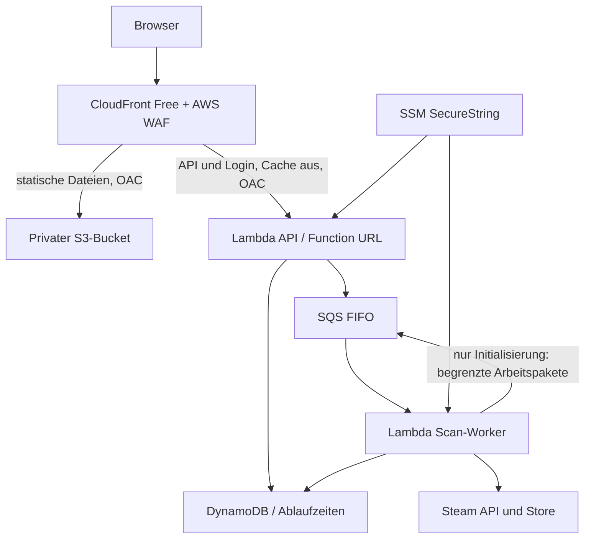

# Replay Radar: AWS-Hosting

Stand: 16. September 2026. Infrastruktur und Deployment sind im Repository definiert. Am 16. September 2026 erfolgreich bereitgestellt: [replay-radar.com](https://replay-radar.com), ACM gültig, CloudFront-Free-Abonnement **ACTIVE**, einschließlich WAF und vorhandener Route-53-Zone. Region für Backend und Daten: Frankfurt (`eu-central-1`). CloudFront ist global, der zugehörige WAF liegt technisch in `us-east-1`.

## Empfehlung

**CloudFront Free Flat-Rate + privater S3-Bucket + Lambda + DynamoDB + SQS FIFO**, verwaltet mit Terraform. Kein dauerhaft laufender Server, keine RDS-Datenbank, kein Load Balancer und kein NAT-Gateway. Die vorhandene React-App bleibt erhalten.



Die Function URL akzeptiert nur von CloudFront signierte Zugriffe. Dadurch lässt sich die WAF nicht einfach über die Origin-URL umgehen. Für POST-Anfragen berechnet das Frontend den von Lambda-OAC geforderten SHA256-Body-Hash. Login- und API-Antworten werden **niemals von CloudFront gecacht**.

## Kostenmodell

| Teil | Auslegung | Erwartung bei privater Nutzung |
|---|---|---|
| CloudFront + WAF | Explizites `FREE`-Abo: 1 Mio. Requests und 100 GB monatliche Nutzungsrichtwerte, 5 WAF-Regeln möglich | 0 USD, bei erfolgreicher Aktivierung und Kontoeignung |
| S3 | Kleine statische Website; OAC, kein öffentlicher Bucket | Geringe Request-Kosten; bis 5 GB S3-Standard-Speichergutschrift im CloudFront-Plan |
| Lambda | ARM64, 256 MB; API maximal 5, Worker 1 gleichzeitige Ausführung | Meist innerhalb des geteilten Freikontingents |
| DynamoDB | On-demand; komprimierte Datensätze, keine Indizes, kein PITR | Typischerweise Centbeträge; On-demand-Requests sind nicht das Provisioned-Free-Tier |
| SQS | Ein FIFO-Worker, bis zu drei Spiele pro dauerhaft gespeichertem Schritt | Bei kleinem Volumen gewöhnlich innerhalb des SQS-Freikontingents |
| SSM + Logs | Standard-Parameter, Standard-Durchsatz; Logs 7 Tage | Klein; abhängig von Decrypts, Logvolumen und verbleibenden Freikontingenten |

**Planungswert: etwa 0–2 USD/Monat**, ohne Domain und Steuern. Annahme: 5–10 bekannte Nutzer, wenige hundert gespielte Titel pro Nutzer, etwa ein Scan pro Woche, insgesamt ungefähr 10.000 Worker-Schritte im Monat, keine Dauer-Polling-Browser. Das ist eine Abschätzung und kein Kostendeckel.

Beispiel für Lambda vor Freikontingent: 10.000 Schritte × 3 Sekunden × 0,25 GB = 7.500 GB-Sekunden. Tatsächliche Laufzeiten hängen von Steam und der Trefferzahl ab. Lambda stellt monatlich 1 Mio. Requests und 400.000 GB-Sekunden bereit; diese Kontingente können durch andere Projekte schon verbraucht sein. DynamoDB-Schreibabfragen kosten in Frankfurt laut live abgefragter AWS Pricing API derzeit **0,7625 USD pro Million Write Request Units**; eine große Snapshot-Aktualisierung verbraucht mehrere Einheiten.

Der CloudFront-Free-Plan deckelt **nicht** die Rechnung von Lambda, DynamoDB oder anderen Origins. Terraform setzt begrenzte Lambda-Parallelität; die App verhindert beliebige Neuscans bei jedem Aufruf. Ein optionaler monatlicher 5-USD-Budgetalarm ist vorbereitet, stoppt aber keine Ressourcen. Er ist ausdrücklich kontoweit und kann deshalb auch durch andere Projekte auslösen; ohne `budget_email` wird er nicht angelegt.

### Free-Plan: verifizierter Status und Grenzen

- Der CloudFormation-Ressourcentyp `AWS::PricingPlanManager::Subscription` wurde im aktiven Konto lesend bestätigt. Das Deployment hat die Kombination erfolgreich aktiviert; Terraform-Ausgabe `free_plan_status` ist `ACTIVE`.
- Die aktuelle AWS-CLI in WSL kennt den neuen PricingPlanManager-Befehl noch nicht. Terraform verwaltet deshalb das **native CloudFormation-Abo**; es gibt keinen fragilen Shell-Workaround und keinen automatischen Wechsel in einen bezahlten Plan.
- Vor der Abofreigabe fallen CloudFront/WAF zunächst unter Pay-as-you-go. Wenn das Abo fehlschlägt, legt Terraform bereits erfolgreich erstellte Ressourcen **nicht automatisch wieder still**. Das Deployment gilt dann als gescheitert; die projektspezifischen Ressourcen müssen wieder entfernt werden. Die WAF ohne Abo hätte feste Grundkosten (bei drei Regeln grob 8 USD/Monat plus Requests).
- Neuere AWS-Konten im eingeschränkten Free-Account-Plan sind laut AWS nicht berechtigt. Die Account-Plan-Abfrage war vorab uneindeutig; die erfolgreiche Aktivierung bestätigt nun die Berechtigung dieses Deployments. Es wird keine kostenpflichtige Alternative stillschweigend aktiviert.

## Cache, Daten und Löschung

| Daten | Inhalt | Verwendung / Ablauf |
|---|---|---|
| Nutzer-Partition | HMAC-Alias aus SteamID + serverseitigem Salt | Kein Klarname im Partitionsschlüssel |
| Bibliothek | AppID, Titel, Spielminuten insgesamt/letzte 14 Tage, Icon, letzter Spielzeitpunkt | 24 h frisch; nach 7 Tagen nicht mehr verwendbar |
| Radar-Snapshot | Gefundene Spiele, News-Titel, Quellen, Kategorien, Score-Grundlagen, Scan-Zeit | Bis 7 Tage direkt anzeigen; neuer Scan frühestens nach 24 h und nur auf Anforderung |
| „Keine Lust“ | AppID, Titel, Ablaufzeit | Für 7 Tage ausblenden; jederzeit wiederherstellbar |
| „Später nochmal“ | AppID, Titel, Zeitpunkt | 1, 3 oder 7 Tage; danach automatisch sichtbar |
| Öffentliche Steam-Metadaten | Genre, Koop-Kategorien, Cover-URL, relevante News | 24 h frisch, bis 7 Tage Aufbewahrung |
| Anmeldung | SteamID, angezeigter Name/Avatar, HMAC-Alias | 12 Stunden; Sitzungscookie ist zufällig, serverseitig wird nur sein Hash als Schlüssel verwendet |
| Freundesliste | Namen, Avatar-URLs, SteamIDs | 24 Stunden, damit Auswahl und Eigentumsvergleich funktionieren |
| OpenID-Zustand | Einmaliger Login-Vorgang | 10 Minuten; atomar verbraucht |
| Jobs / Queue / Logs | Fortschritt oder Fehlerdiagnose | Maximal 7 Tage; SteamID des Vergleichspartners wird nach dem initialen Bibliotheksabruf aus dem Job entfernt |

Ein Alias und Titel allein reichen nicht: „seit zuletzt gespielt“ braucht Zeitpunkte, die Freundesabfrage vorübergehend SteamIDs und der Login einen überprüfbaren Sitzungszustand. Passwörter werden nie angenommen. Der Betreiber-Key und der Salt liegen in **SSM SecureString**, außerhalb von Terraform-State und Browser-Bundle. Der Zugang ist offen. Das Konfigurationsskript verlangt dafür ausdrücklich `--public-access`; alternativ ist eine SteamID-Gästeliste möglich.

**DynamoDB TTL löscht asynchron**, häufig erst einige Tage nach dem Ablaufdatum. Die Anwendung ignoriert Datensätze schon exakt ab ihrem Ablaufzeitpunkt. Sieben Tage bedeuten daher logisch sieben Tage, nicht garantiert physische Löschung auf die Sekunde. Es sind keine bezahlten Backups oder Streams aktiviert. Konfiguration, statische Website und Infrastruktur bleiben erhalten; nur kurzlebige Nutzdaten laufen ab.

Keine regelmäßigen Vollscans und kein nächtlicher Scheduler. Nach einem Seiten- oder Serverneustart wird der gespeicherte Radar geladen. SQS setzt begonnene Scans unabhängig vom Browser fort. Bei doppelter Zustellung zählt der Worker ein Spiel nicht noch einmal; das wurde mit einem simulierten Fehler zwischen Speichern und Enqueue getestet. Bei mehr als 30 Minuten ohne Fortschritt zeigt die App einen unterbrochenen Scan an.

## Infrastruktur und Betrieb

Pfad: `/home/jsteiner/src/replay-radar/infra`

- `versions.tf`: Region, Provider, Variablen; Provider-Versionen zusätzlich in `.terraform.lock.hcl` fixiert.
- `backend.tf`: DynamoDB mit TTL, SQS + Dead Letter Queue, zwei Lambdas, IAM, Logs und öffentliche Origin-Konfiguration.
- `edge.tf`: CloudFront, privater S3-Bucket, OAC, WAF, natives CloudFormation-Free-Abo.
- `budget.tf`: optionaler Budgetalarm.
- `scripts/terraform.py`: verwendet die aktive AWS-CLI-Login-Sitzung, ohne Zugangsdaten auf Platte zu schreiben oder auszugeben.
- `scripts/upload-config.py`: expliziter Deployment-Schritt; liest `.env`, lädt Key/Salt und die zugelassenen SteamIDs als SecureString hoch. Kein automatischer Aufruf bei Build oder Plan.

WAF: AWS IP Reputation, Common Rule Set und Rate Limit von 500 Requests pro IP in fünf Minuten. Die Common-Regel `GenericRFI_QUERYARGUMENTS` wird auf Count gesetzt, da Steam-OpenID legitime externe URLs in Query-Parametern übermittelt. Andere Standardregeln bleiben aktiv. WAF-Request-Logging und zusätzliche kostenpflichtige Bot-Control-Funktionen sind aus.

### Infrastruktur bereitstellen

```bash
cd /home/jsteiner/src/replay-radar
export PATH="$PWD/.runtime/bin:$PATH"
npm ci
npm test
npm run build
node scripts/build-aws.mjs

# Offener Zugang; alternativ --steam-id mit einer Gästeliste:
python3 scripts/upload-config.py --public-access

python3 scripts/terraform.py init
python3 scripts/terraform.py plan -out=replay-radar.tfplan
# Optional für einen kontoweiten Budgetalarm:
# python3 scripts/terraform.py plan -var='budget_email=deine-adresse@example.org' -out=replay-radar.tfplan

# Geprüften Plan anwenden:
python3 scripts/terraform.py apply replay-radar.tfplan
python3 scripts/terraform.py output
```

Vor der Veröffentlichung muss `free_plan_status` **ACTIVE** sein. Ohne diesen Status keine erfolgreiche Fertigmeldung. Danach: `/api/session` prüfen, sicherstellen, dass die direkte Lambda-URL ohne Signatur 403 liefert, vollständige Steam-Anmeldung über die neue HTTPS-Domain durchführen, echten Scan und Freundesvergleich prüfen. Steam-Key-Domain bei Bedarf auf den endgültigen Host aktualisieren. `domain.tf` nutzt die vorhandene Route-53-Zone für `replay-radar.com`, validiert ACM in us-east-1 per DNS und erstellt A/AAAA-Aliase. Die Zone selbst wird nicht neu angelegt. Login und Origin-Prüfung nutzen ausschließlich die kanonische Domain.

Es wird mit lokalem, ignoriertem Terraform-State gearbeitet, der keine Steam-Secrets enthält. Für gemeinsame Infrastrukturpflege später einen gesicherten Remote-State einrichten. State und gespeicherten Plan vertraulich behandeln; sie enthalten Infrastrukturdetails. Ein Apply-Plan muss nach Code-, Konfigurations- oder Infrastrukturänderungen neu erzeugt werden.

### App-Version veröffentlichen

**Terraform besitzt die Infrastruktur; GitHub Actions besitzt den App-Code.** Terraform stellt den ersten Lambda-Code beim Anlegen bereit und ignoriert danach Änderungen an Code-Pfad und Hash. S3-Objekte sind keine Terraform-Ressourcen. Dadurch setzt ein Infrastruktur-Apply keine ältere App zurück.

Der Workflow **Deploy** wird manuell auf `main` gestartet. Er installiert aus dem Lockfile, prüft Node- und Browser-Tests, baut Frontend/Lambda und übernimmt erst danach die AWS-Rolle per OIDC. Die Rolle darf nur App-Dateien schreiben, die zwei Funktionen aktualisieren und den Cache dieser Distribution invalidieren. Sie darf keine Infrastruktur ändern oder Steam-Secrets lesen. Die Trust Policy ist an die unveränderlichen GitHub-Owner-/Repository-IDs und `main` gebunden. Pull Requests laufen nur durch CI ohne AWS-Rechte. Actions sind auf Commit-SHAs fixiert.

Repository-Variablen aus Terraform-Ausgaben setzen: `AWS_DEPLOY_ROLE`, `STATIC_BUCKET`, `DISTRIBUTION_ID`. Anschließend auf GitHub unter Actions → Deploy → Run workflow starten. Kein automatisches Produktionsdeployment bei beliebigen Pushes.

Für das erste lokale Release nach erfolgreichem Apply und `ACTIVE`-Free-Plan:

```bash
export STATIC_BUCKET=$(python3 scripts/terraform.py output -raw static_bucket)
export DISTRIBUTION_ID=$(python3 scripts/terraform.py output -raw distribution_id)
bash scripts/deploy-app.sh
```

Gehashten Assets folgen sonstige Dateien und zuletzt `index.html`. Alte Assets bleiben für bereits offene Browser erhalten. Bei Bedarf später gezielt alte Hashes bereinigen; keine pauschale Löschung während eines Releases. Lambda und Frontend werden nacheinander veröffentlicht; Änderungen müssen währenddessen kompatibel bleiben. Rollback: einen bekannten Commit lokal auschecken, testen/bauen und mit demselben Skript veröffentlichen.

### Entfernen

Zuerst Terraform-Destroy-Plan prüfen. Der Bucket erlaubt kein `force_destroy` und muss gezielt geleert werden. Der separat hochgeladene SecureString bleibt bis zur gezielten Entfernung bestehen. Kündigungen des Free-Abos können laut AWS erst zum Ende des Abrechnungszeitraums wirksam werden; Ressourcen nicht verwaisen lassen.

### Grenzen

- Der Zugang ist öffentlich. Der Kostenwert oben gilt weiterhin nur für das genannte kleine Nutzungsvolumen, nicht für beliebig viele Besucher.
- WAF drosselt pro IP; begrenzte Lambda-Parallelität und Scan-Caches bremsen Last, sind aber keine harte Rechnungsgrenze. Bei starkem Wachstum Nutzerkontingente und Kapazitätsplanung ergänzen.
- DynamoDB-Einzelrecords sind auf 350 KB komprimiert begrenzt. Außergewöhnlich große Bibliotheken brauchen Sharding; Fehler werden sichtbar gemeldet.
- Persönliche Steam-Anmeldung und echte Bibliotheks-/Freundesdaten können nur mit einem interaktiven Benutzer überprüft werden. Automatische Tests ersetzen diesen Schritt nicht.
- Terraform-State liegt lokal, ignoriert und ohne Steam-Key. Für gemeinsame Infrastrukturpflege einen gesicherten Remote-State ergänzen; die App-Deployment-Action braucht keinen State.

## Quellen

- [CloudFront-Pläne und Preise](https://aws.amazon.com/cloudfront/pricing/)
- [Flat-Rate-Features und Einschränkungen](https://docs.aws.amazon.com/AmazonCloudFront/latest/DeveloperGuide/flat-rate-pricing-plan.html)
- [Natives CloudFormation-Abo](https://docs.aws.amazon.com/AWSCloudFormation/latest/TemplateReference/aws-resource-pricingplanmanager-subscription.html)
- [Lambda-Preise](https://aws.amazon.com/lambda/pricing/)
- [DynamoDB-Preise](https://aws.amazon.com/dynamodb/pricing/)
- [DynamoDB TTL](https://docs.aws.amazon.com/amazondynamodb/latest/developerguide/TTL.html)
- [Lambda-OAC und POST-Payload-Hash](https://docs.aws.amazon.com/AmazonCloudFront/latest/DeveloperGuide/private-content-restricting-access-to-lambda.html)
- [WAF-Preise ohne Flat-Rate-Abo](https://aws.amazon.com/waf/pricing/)


## Live-Prüfung vom 16. September 2026

- TLS und DNS für `replay-radar.com` aktiv.
- Anonymer `/api/session` liefert 200, bestätigt serverseitige Key-Konfiguration und setzt `Cache-Control: no-store`.
- Präferenzen/Scans ohne Sitzung: 401; fremder Origin bei Schreibzugriff: 403.
- Direkte Lambda-Function-URL ohne CloudFront-Signatur: 403.
- CloudFormation-Free-Subscription: ACTIVE.
- Automatische Tests: 12 Node-Tests und 11 Browser-Tests; GitHub CI ebenfalls erfolgreich.
- Ein kompletter persönlicher Login mit anschließendem echten Radar-Scan und Freundesvergleich bleibt ein interaktiver Abnahmeschritt.

- [GitHub-Deployment mit OIDC erfolgreich](https://github.com/operatorofthings/replay-radar/actions/runs/35069327916).
- Produktions-Browsertest: Einführung, Score-Erklärung, Sofort-Ausblenden/Rückgängig, gewichtetes Rad und Steam-Redirect mit Secure-/HttpOnly-Cookie erfolgreich, keine Browserfehler.
- Live-DynamoDB-Test mit kurzlebiger synthetischer Testsitzung: getrennte Radar-/Koop-Präferenzen, Wiederherstellung und Logout erfolgreich; Testdaten anschließend entfernt.


## Scan-Korrektur: keine rekursive SQS-Kette

Der erste persönliche Scan stoppte bei 15/305: AWS meldete `RecursiveInvocationsDropped`, weil jeder Worker-Schritt seinen Nachfolger in dieselbe Queue schrieb. Statt diesen Schutz abzuschalten, plant jetzt nur die Initialisierung alle verbleibenden Pakete vorab ein. Jedes Paket prüft maximal drei Spiele parallel und veröffentlicht keine Nachfolger. Store-Aufrufe bleiben global seriell gedrosselt. Lambda-Rekursionsschutz bleibt unverändert aktiv.

Die FIFO-Reihenfolge und gespeicherten Cursor verhindern Doppelzählungen. Wiederholte Initialisierung plant nur noch ausstehende Pakete; fehlgeschlagene Batch-Zustellung wird wiederholt. News-Anfragen fordern nur einen minimalen Inhaltsauszug an, da ausschließlich Überschrift, Datum und Quellen-URL gebraucht werden. Die UI schätzt nach mehreren Paketen die Restzeit und kennzeichnet längere Fortschrittspausen. Das ist keine garantierte Dauer; Steam-Latenz und Drosselung bleiben bestimmend.
